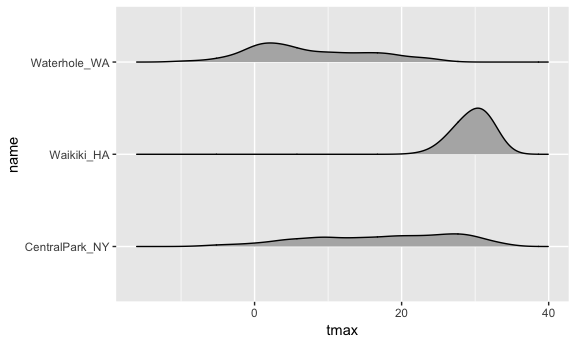
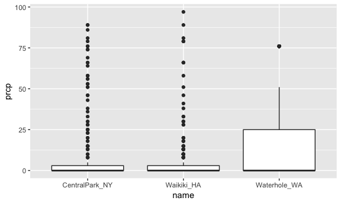

Visualization
================
Guojing Wu

-   [start a plot](#start-a-plot)
    -   [more options](#more-options)
    -   [other interesting plot](#other-interesting-plot)
    -   [density plot](#density-plot)
    -   [boxplot](#boxplot)
    -   [ridges plot](#ridges-plot)
-   [last example](#last-example)
-   [part ii](#part-ii)
    -   [scatterplot with parameter](#scatterplot-with-parameter)
    -   [color and theme](#color-and-theme)
    -   [geom\_\* arguments](#geom_-arguments)

data import

``` r
weather_df = 
  rnoaa::meteo_pull_monitors(c("USW00094728", "USC00519397", "USS0023B17S"),
                      var = c("PRCP", "TMIN", "TMAX"), 
                      date_min = "2017-01-01",
                      date_max = "2017-12-31") %>%
  mutate(
    name = recode(id, USW00094728 = "CentralPark_NY", 
                      USC00519397 = "Waikiki_HA",
                      USS0023B17S = "Waterhole_WA"),
    tmin = tmin / 10,
    tmax = tmax / 10) %>%
  select(name, id, everything())
```

start a plot
------------

blank

``` r
ggplot(weather_df, aes(x = tmin, y = tmax))
```


scatterplot

``` r
ggplot(weather_df, aes(x = tmin, y = tmax)) +
  geom_point()
```

    ## Warning: Removed 15 rows containing missing values (geom_point).


filter

``` r
weather_df %>%
  filter(name == "CentralPark_NY") %>%
  ggplot(aes(x = tmin, y = tmax)) +
  geom_point()
```


or just save it into a variable

``` r
weather_sp = 
  ggplot(weather_df, aes(x = tmin, y = tmax)) +
  geom_point()
```

### more options

color

``` r
ggplot(weather_df, aes(x = tmin, y = tmax)) +
  geom_point(aes(color = name))
```

    ## Warning: Removed 15 rows containing missing values (geom_point).


add a geom

``` r
ggplot(weather_df, aes(x = tmin, y = tmax)) +
  geom_point(aes(color = name)) +
  geom_smooth(se = FALSE)
```

    ## `geom_smooth()` using method = 'gam' and formula 'y ~ s(x, bs = "cs")'

    ## Warning: Removed 15 rows containing non-finite values (stat_smooth).

    ## Warning: Removed 15 rows containing missing values (geom_point).


make it transparent

``` r
ggplot(weather_df, aes(x = tmin, y = tmax)) +
  geom_point(aes(color = name, alpha = 0.4)) +
  geom_smooth(se = FALSE)
```

    ## `geom_smooth()` using method = 'gam' and formula 'y ~ s(x, bs = "cs")'

    ## Warning: Removed 15 rows containing non-finite values (stat_smooth).

    ## Warning: Removed 15 rows containing missing values (geom_point).


so what will happen if I put color parameters in ggplot()? It became a global parameter

``` r
ggplot(weather_df, aes(x = tmin, y = tmax, color = name)) +
  geom_point() +
  geom_smooth(se = FALSE)
```

    ## `geom_smooth()` using method = 'loess' and formula 'y ~ x'

    ## Warning: Removed 15 rows containing non-finite values (stat_smooth).

    ## Warning: Removed 15 rows containing missing values (geom_point).


now we seperate the plot into different facets according to name

``` r
ggplot(weather_df, aes(x = tmin, y = tmax, color = name)) +
  geom_point() +
  geom_smooth(se = FALSE) +
  facet_grid( ~ name)
```

    ## `geom_smooth()` using method = 'loess' and formula 'y ~ x'

    ## Warning: Removed 15 rows containing non-finite values (stat_smooth).

    ## Warning: Removed 15 rows containing missing values (geom_point).


### other interesting plot

``` r
ggplot(weather_df, aes(x = date, y = tmax)) +
  geom_point(aes(color = name))
```

    ## Warning: Removed 3 rows containing missing values (geom_point).


using line instead

``` r
ggplot(weather_df, aes(x = date, y = tmax)) +
  geom_line(aes(color = name))
```


seperate them

``` r
ggplot(weather_df, aes(x = date, y = tmax, color = name)) +
  geom_point() +
  geom_smooth(se = FALSE) +
  facet_grid( ~ name)
```

    ## `geom_smooth()` using method = 'loess' and formula 'y ~ x'

    ## Warning: Removed 3 rows containing non-finite values (stat_smooth).

    ## Warning: Removed 3 rows containing missing values (geom_point).


if you put color parameters into aes(), and "blue" doesn't exist, it'll just create another variable "color" and make every term equals to "blue"

``` r
ggplot(weather_df) + geom_point(aes(x = tmax, y = tmin), color = "blue")
```

    ## Warning: Removed 15 rows containing missing values (geom_point).


``` r
ggplot(weather_df) + geom_point(aes(x = tmax, y = tmin, color = "blue"))
```

    ## Warning: Removed 15 rows containing missing values (geom_point).


### density plot

``` r
ggplot(weather_df, aes(x = tmin, fill = name)) +
  geom_density(alpha = 0.4)
```

    ## Warning: Removed 15 rows containing non-finite values (stat_density).


### boxplot

``` r
ggplot(weather_df, aes(x = name, y = tmax)) +
  geom_boxplot()
```

    ## Warning: Removed 3 rows containing non-finite values (stat_boxplot).


### ridges plot

``` r
ggplot(weather_df, aes(x = tmax, y = name)) +
  geom_density_ridges(scale = 0.5)
```

    ## Picking joint bandwidth of 1.84

    ## Warning: Removed 3 rows containing non-finite values (stat_density_ridges).



last example
------------

make a bunch of plot

``` r
ggplot(weather_df, aes(y = prcp, x = name)) +
  geom_boxplot()
```

    ## Warning: Removed 3 rows containing non-finite values (stat_boxplot).


``` r
ggplot(weather_df, aes(y = prcp, x = name)) +
  geom_violin()
```

    ## Warning: Removed 3 rows containing non-finite values (stat_ydensity).


``` r
weather_df %>%
  filter(prcp < 100) %>%
  ggplot(aes(y = prcp, x = name)) +
  geom_boxplot()
```



part ii
-------

### scatterplot with parameter

``` r
ggplot(weather_df, aes(x = tmin, y = tmax)) + 
  geom_point(aes(color = name), alpha = .5) + 
  labs(
    title = "Temperature plot",
    x = "Minimum daily temperature (C)",
    y = "Maxiumum daily temperature (C)",
    caption = "Data from the rnoaa package"
  )
```

    ## Warning: Removed 15 rows containing missing values (geom_point).


tick makrs and labels (not that x is continuous here)

``` r
ggplot(weather_df, aes(x = tmin, y = tmax)) + 
  geom_point(aes(color = name), alpha = .5) + 
  labs(
    title = "Temperature plot",
    x = "Minimum daily temperature (C)",
    y = "Maxiumum daily temperature (C)",
    caption = "Data from the rnoaa package"
  ) + 
  scale_x_continuous(breaks = c(-15, 0, 15), 
                     labels = c("-15º C", "0º C", "15º C")
  ) +
  scale_y_continuous(
    position = "right", 
    trans = "sqrt"
  )
```

    ## Warning in self$trans$transform(x): 产生了NaNs

    ## Warning: Transformation introduced infinite values in continuous y-axis

    ## Warning: Removed 90 rows containing missing values (geom_point).


### color and theme

adjust color

``` r
ggplot(weather_df, aes(x = tmin, y = tmax)) + 
  geom_point(aes(color = name), alpha = .5) + 
  labs(
    title = "Temperature plot",
    x = "Minimum daily temperature (C)",
    y = "Maxiumum daily temperature (C)",
    caption = "Data from the rnoaa package"
  ) + 
  scale_color_hue(
    name = "location", 
    h = c(100,350), 
    l = 75, 
  )
```

    ## Warning: Removed 15 rows containing missing values (geom_point).


using viridis package for a better plot

``` r
ggplot(weather_df, aes(x = tmin, y = tmax)) + 
  geom_point(aes(color = name), alpha = .5) + 
  labs(
    title = "Temperature plot",
    x = "Minimum daily temperature (C)",
    y = "Maxiumum daily temperature (C)",
    caption = "Data from the rnoaa package"
  ) + 
  viridis::scale_color_viridis(
    name = "location", 
    discrete = TRUE, 
  )
```

    ## Warning: Removed 15 rows containing missing values (geom_point).


change the legend

``` r
ggplot(weather_df, aes(x = tmin, y = tmax)) + 
  geom_point(aes(color = name), alpha = .5) + 
  labs(
    title = "Temperature plot",
    x = "Minimum daily temperature (C)",
    y = "Maxiumum daily temperature (C)",
    caption = "Data from the rnoaa package"
  ) + 
  viridis::scale_color_viridis(
    name = "location", 
    discrete = TRUE, 
  ) +
  theme(legend.position = "bottom")
```

    ## Warning: Removed 15 rows containing missing values (geom_point).


change the grey background

``` r
ggplot(weather_df, aes(x = tmin, y = tmax)) + 
  geom_point(aes(color = name), alpha = .5) + 
  labs(
    title = "Temperature plot",
    x = "Minimum daily temperature (C)",
    y = "Maxiumum daily temperature (C)",
    caption = "Data from the rnoaa package"
  ) + 
  viridis::scale_color_viridis(
    name = "location", 
    discrete = TRUE, 
  ) +
  theme_bw() +
  theme(legend.position = "bottom") # here, order matters. If you put theme precedent to theme_bw, when the theme_bw applied, it will overwrite all the former parameters.
```

    ## Warning: Removed 15 rows containing missing values (geom_point).


assessment

``` r
ggplot(weather_df, aes(x = date, y = tmax, color = name)) + 
  geom_point() +
  geom_smooth(se = FALSE) +
  labs(
    title = "tmax over the year"
  ) + 
  viridis::scale_color_viridis(
    name = "location", 
    discrete = TRUE, 
  ) + 
  theme(legend.position = "bottom")
```

    ## `geom_smooth()` using method = 'loess' and formula 'y ~ x'

    ## Warning: Removed 3 rows containing non-finite values (stat_smooth).

    ## Warning: Removed 3 rows containing missing values (geom_point).


### geom\_\* arguments

Adding plot using data from another dataset

``` r
centralpark_df = weather_df %>% filter(name == "CentralPark_NY")
waikiki_df = weather_df %>% filter(name == "Waikiki_HA")

ggplot(waikiki_df, aes(x = date, y = tmax, color = name)) +
  geom_point() +
  geom_line(data = centralpark_df)
```

    ## Warning: Removed 3 rows containing missing values (geom_point).


